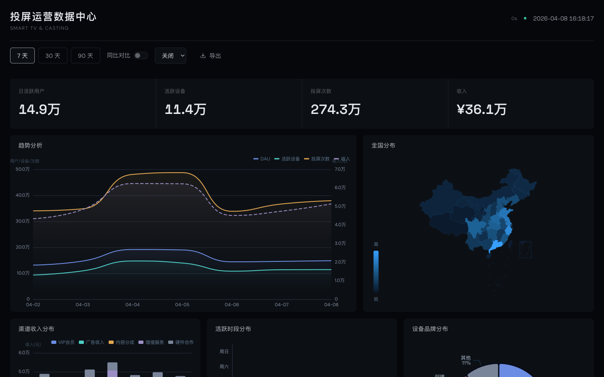

# Lebo BI Dashboard

> Full-stack BI analytics dashboard for Smart TV & screen-casting products.

A production-style data visualization platform built with **Vue 3 + FastAPI**, featuring 8 chart types, period-over-period comparison, WebSocket real-time updates, and CSV export. Designed with a refined dark theme optimized for readability across desktop monitors and large-screen displays.



## Features

### Data Overview
- 4 KPI metric cards with animated number transitions (DAU / Active Devices / Screen Casts / Revenue)
- Period-over-period comparison with change percentage indicators

### 8 Visualization Types
| Chart | Description |
|-------|-------------|
| Trend Line | Multi-metric area chart with dual Y-axis, comparison overlay |
| China Heatmap | Province-level user distribution on geographic map |
| Channel Bar | Stacked bar chart breaking down 5 revenue channels |
| Hourly Heatmap | Day-of-week x hour-of-day activity pattern |
| Brand Donut | Device brand market share (Xiaomi / Hisense / TCL / Huawei / Skyworth) |
| Conversion Funnel | 5-stage funnel from app open to content playback |
| KPI Gauges | Target achievement rate for DAU and revenue |
| Retention Analysis | Retention curve + cohort heatmap table |

### Interactive Controls
- Time range switching (7 / 30 / 90 days) with full chart synchronization
- Period comparison toggle
- Auto-refresh (30s / 60s / 120s intervals)
- CSV data export
- WebSocket connection status indicator

## Architecture

```
┌──────────────── Vue 3 SPA (Vite + ECharts) ─────────────────┐
│  8 Chart Types  │  Composition API  │  OKLCH Design System   │
└────────────────────────┬─────────────────────────────────────┘
                         │ REST API + WebSocket
┌────────────────────────▼─────────────────────────────────────┐
│               FastAPI Backend (:8000)                         │
│  11 API Endpoints  │  Modular Routers  │  Mock Data Engine   │
│  WebSocket Push    │  CSV Export       │  SPA Static Serving  │
└──────────────────────────────────────────────────────────────┘
```

## Tech Stack

| Layer | Technology |
|-------|-----------|
| Backend | Python 3.9+ / FastAPI / Uvicorn / WebSocket |
| Frontend | Vue 3 Composition API / Vite 5 / ECharts 5 / Axios |
| Typography | Space Grotesk (display) + DM Sans (body) |
| Design | OKLCH color system, CSS Custom Properties, dark theme |
| Data | Seeded random generation, 180-day history, 7 data dimensions |

## Quick Start

```bash
git clone https://github.com/your-username/lebo-bi-dashboard.git
cd lebo-bi-dashboard
./run.sh
```

Open http://localhost:8000

**Requirements**: Python 3.9+, Node.js 16+

The `run.sh` script handles everything: creates a Python venv, installs backend dependencies, installs frontend packages, builds the Vue SPA, and starts the FastAPI server.

## Development

```bash
# Terminal 1 — Backend with hot reload
source .venv/bin/activate
PYTHONPATH=. python -m backend.main

# Terminal 2 — Frontend with HMR (proxies API to :8000)
cd frontend && npm run dev
```

## API Reference

| Endpoint | Description |
|----------|-------------|
| `GET /api/metrics?days=7&compare=true` | Daily metrics with optional period comparison |
| `GET /api/metrics/hourly?days=7` | Hourly granularity activity data |
| `GET /api/brands` | Device brand distribution |
| `GET /api/regional` | Province-level geographic data |
| `GET /api/channels?days=7` | Revenue breakdown by channel |
| `GET /api/funnel` | Conversion funnel stages |
| `GET /api/retention` | User retention cohort table |
| `GET /api/content/top?limit=10` | Top cast content ranking |
| `GET /api/devices/top?limit=10` | Top device model ranking |
| `GET /api/export/csv?type=metrics&days=30` | CSV data export |
| `WS /ws/realtime` | Real-time data push (3s interval) |

## Project Structure

```
├── backend/
│   ├── main.py                 # FastAPI app, router mounting, SPA serving
│   ├── config.py               # Server configuration
│   ├── mock_data/              # Data generation engine (7 modules)
│   │   ├── generator.py        # Seeded RNG core
│   │   ├── daily_metrics.py    # 180-day daily KPIs
│   │   ├── hourly_metrics.py   # Hour-level activity patterns
│   │   ├── regional.py         # 31 province distribution
│   │   ├── retention.py        # 8-week cohort retention
│   │   ├── funnel.py           # 5-stage conversion funnel
│   │   ├── channels.py         # 5 revenue channels × 90 days
│   │   └── content.py          # Top content & device rankings
│   └── routers/                # API route handlers (9 modules)
├── frontend/
│   ├── vite.config.js          # Build config with API proxy
│   └── src/
│       ├── api/                # Axios request modules
│       ├── composables/        # useAutoRefresh, useChartResize, useWebSocket, useTheme
│       ├── components/
│       │   ├── layout/         # DashHeader, DashToolbar, ChartPanel
│       │   ├── cards/          # MetricCard, AnimatedNumber
│       │   └── charts/         # 8 chart components (ECharts)
│       ├── views/              # Dashboard.vue (main orchestrator)
│       ├── assets/             # China GeoJSON
│       └── styles/             # OKLCH variables, global reset
├── run.sh                      # One-command startup
└── requirements.txt
```

## License

MIT
